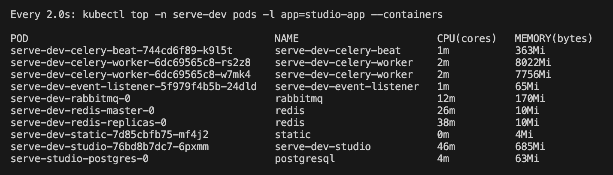
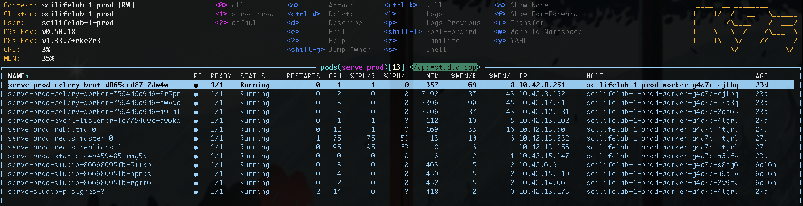

On this page, you will find 2 ways to monitor cluster resources like pods in realtime.

### Local context

Make sure you are using the correct context:

```Bash
export KUBECONFIG=~/.kube/config:~/.kube/scilifelab-1-dev.yaml
kubectl config use-context scilifelab-1-dev
# kubectl config get-contexts
```

### Realtime view using `kubectl top`

The top command is built into the kubectl tool and can be used as follows:

```Bash
# Watch pods
watch kubectl top pods

# Watch containers within pods
watch kubectl top pods --containers

# Watch a targeted pod
watch kubectl top -n serve-dev pods -l app=studio-app --containers
```

<div align="center">
    
</div>

### Realtime view using `k9s`

[k9s](https://k9scli.io/) is a tool used to interact with a cluster from the command-line. It provides more information than `kubectl top`.

1. Install k9s on Mac:

```Bash
# Install k9s
brew install derailed/k9s/k9s
```

2. Start a session:

```Bash
k9s -n serve-dev
```

3. Narrow down your view to a specific pod. With the session open, type: `/app=studio-app`

<div align="center">
    
</div>
